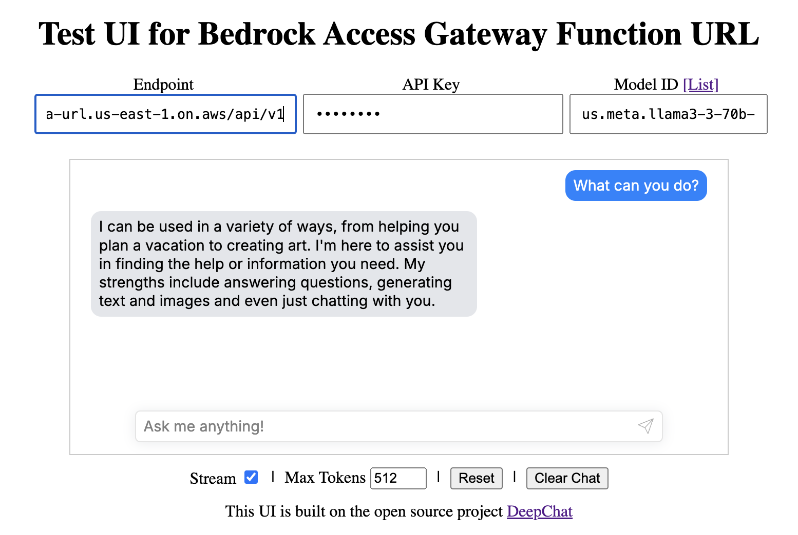

# bedrock-access-gateway-function-url

This repo is combining the great works of the original implementations of [bedrock-access-gateway](https://github.com/aws-samples/bedrock-access-gateway/) with [aws-lambda-web-adapter](https://github.com/awslabs/aws-lambda-web-adapter) so that one can deploy an OpenAI API compatible endpoint on AWS Lambda with Function URL and streaming enabled.

This solution is more cost effective than the original `bedrock-access-gateway` solution as it removes the need of fixed cost components (Application Load Balancer and the optional Fargate container, >US$16/month) and the need of a VPC. So that one can use it in a fully pay-as-you-go model.

It also removes the usage of a Lambda Docker runtime to avoid the use of a ECR repository in order to reduce Lambda cold start times.

Read more on the creation of this project [here](https://dev.to/aws-builders/use-amazon-bedrock-models-via-an-openai-api-compatible-serverless-endpoint-now-without-fixed-cost-5hf5).

## Changes from the Original Access Gateway

- Removes Application Load Balancer -> Lambda Function URL
- Docker Lambda Runtime -> Python Lambda Runtime
- Optionally removes `numpy` and `tiktoken` dependencies when embedding models are not needed
- Deployment option with CloudShell -> Fast and efficient!

## Deployment

Under both deployment options, `--no-embeddings` is optional. If you want to speed up the inference as well as reduce the Lambda Layer, you can exclude the embeddings from the deployment package.

### Local Build

Make sure you have `sam` and Docker installed.

```shell
# Fetchs and builds the latest `bedrock-access-gateway` Python source code
./prepare_source.sh  # [--no-embeddings]

sam build --use-container
sam deploy --guided
```

### AWS CloudShell

If you are using AWS CloudShell VPC environment, make sure it has access to the internet.

```shell
# Dependency installation
sudo yum update -y
sudo yum install -y python3.12 python3.12-pip
(
    cd /tmp && \
    curl -L https://github.com/aws/aws-sam-cli/releases/latest/download/aws-sam-cli-linux-x86_64.zip -o aws-sam-cli-linux-x86_64.zip && \
    unzip -q aws-sam-cli-linux-x86_64.zip -d sam-installation && \
    sudo ./sam-installation/install
)

git clone --depth=1 https://github.com/gabrielkoo/bedrock-access-gateway-function-url
cd bedrock-access-gateway-function-url

./prepare_source.sh  # [--no-embeddings]
sam build
sam deploy --guided
```

## Test

Enter your credentials on my static hosted UI <https://gabrielkoo.github.io/bedrock-access-gateway-function-url/>, 


or just run the code below in your shell:

```shell
curl "${FUNCTION_URL}api/v1/chat/completions" \
     -H "Authorization: Bearer $API_KEY" \
     -X POST \
     -H 'Content-Type: application/json' \
     -d '{
        "stream": true,
        "model": "amazon.nova-micro-v1:0",
        "messages": [{"role": "user", "content": "Tell me what is 1+1"}]
    }'

# > data: {"id":"chatcmpl-61c29444","created":1735753748,"model":"amazon.nova-micro-v1:0","system_fingerprint":"fp","choices":[{"index":0,"finish_reason":null,"logprobs":null,"delta":{"role":"assistant","content":""}}],"object":"chat.completion.chunk","usage":null}
# > data: {"id":"chatcmpl-61c29444","created":1735753748,"model":"amazon.nova-micro-v1:0","system_fingerprint":"fp","choices":[{"index":0,"finish_reason":null,"logprobs":null,"delta":{"content":""}}],"object":"chat.completion.chunk","usage":null}
# > data: {"id":"chatcmpl-61c29444","created":1735753748,"model":"amazon.nova-micro-v1:0","system_fingerprint":"fp","choices":[{"index":0,"finish_reason":null,"logprobs":null,"delta":{"content":"1"}}],"object":"chat.completion.chunk","usage":null}
# > data: {"id":"chatcmpl-61c29444","created":1735753748,"model":"amazon.nova-micro-v1:0","system_fingerprint":"fp","choices":[{"index":0,"finish_reason":null,"logprobs":null,"delta":{"content":"+"}}],"object":"chat.completion.chunk","usage":null}
# > data: {"id":"chatcmpl-61c29444","created":1735753748,"model":"amazon.nova-micro-v1:0","system_fingerprint":"fp","choices":[{"index":0,"finish_reason":null,"logprobs":null,"delta":{"content":"1"}}],"object":"chat.completion.chunk","usage":null}
# > data: {"id":"chatcmpl-61c29444","created":1735753748,"model":"amazon.nova-micro-v1:0","system_fingerprint":"fp","choices":[{"index":0,"finish_reason":null,"logprobs":null,"delta":{"content":" equals"}}],"object":"chat.completion.chunk","usage":null}
# > data: {"id":"chatcmpl-61c29444","created":1735753748,"model":"amazon.nova-micro-v1:0","system_fingerprint":"fp","choices":[{"index":0,"finish_reason":null,"logprobs":null,"delta":{"content":""}}],"object":"chat.completion.chunk","usage":null}
# > data: {"id":"chatcmpl-61c29444","created":1735753748,"model":"amazon.nova-micro-v1:0","system_fingerprint":"fp","choices":[{"index":0,"finish_reason":null,"logprobs":null,"delta":{"content":" 2"}}],"object":"chat.completion.chunk","usage":null}
```

